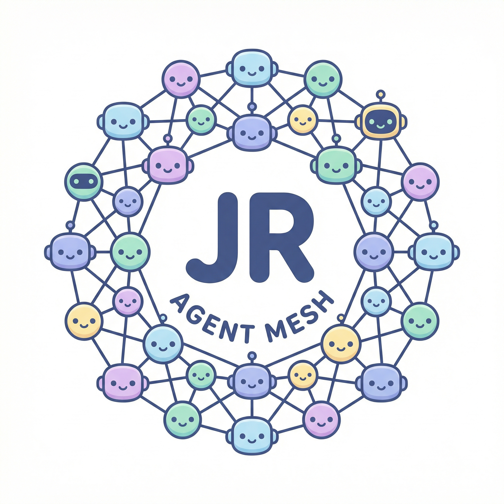

<p align="center">
  
</p>

<h1 align="center">JR Agent Mesh</h1>

<p align="center">A web-based multi-agent management platform for orchestrating multiple AI coding agents (Claude Code, OpenCode, Codex) through a unified interface with built-in chat, real-time terminals, and WebSocket streaming.</p>

## Features

- **Multi-Agent Management** — Spawn, stop, restart, and delete CLI agent processes from a tabbed interface with real-time status indicators
- **Built-in Chat Assistant** — Conversational AI with tool use: file read/write/edit, shell commands, file transfer, and agent dispatch. Supports Anthropic, OpenAI, Google, xAI, Groq, and custom API endpoints
- **Skill System** — Reusable AI knowledge documents that can be installed from GitHub repos or generated from chat conversations via LLM extraction. Skills are injected into the assistant's context with global or per-conversation activation
- **Thinking/Reasoning Display** — Adjustable thinking budget (none/low/medium/high) with interleaved, collapsible thinking blocks in chat messages
- **Integrated Terminals** — Full xterm.js terminals for TUI agents (OpenCode, Codex) and structured output views for Claude Code, all streamed over WebSocket
- **Real-time Streaming** — WebSocket protocol with message fragmentation (>64KB), heartbeat, backpressure management, and auto-reconnect
- **Conversation Management** — Persistent chat history with create, rename, clear, delete, and full database import/export
- **Credential Management** — AES-256-GCM encrypted storage for API keys with per-provider test-connection support and custom credential/endpoint configuration
- **Multi-Provider Model Selection** — Switch between providers and models on the fly with auto-detection of available models via API
- **File Attachments** — Drag-and-drop file upload in chat (images, code, documents) with preview support
- **Keyboard Shortcuts** — `Ctrl+1/2/3` for page navigation, `Ctrl+N` for new conversation, `Ctrl+K` for command palette
- **Agent Dispatch Mode** — Let the built-in assistant automatically delegate tasks to running coding agents with per-conversation workspace isolation

## Tech Stack

| Layer | Technology |
|-------|------------|
| Frontend | Next.js 15, React 19, Tailwind CSS 4, Zustand, Radix UI |
| Backend | Express 4, WebSocket (ws), node-pty, pi-agent-core |
| Database | SQLite (better-sqlite3) + Drizzle ORM |
| Language | TypeScript (100%) |

## Getting Started

### Prerequisites

- **Node.js** >= 18
- **npm** >= 9
- At least one supported CLI agent installed (e.g. `claude`, `opencode`, or `codex`)
- An API key for at least one LLM provider (e.g. `ANTHROPIC_API_KEY`)

### Installation

```bash
git clone https://github.com/xdrshjr/JR-Agent-Mesh.git
cd JR-Agent-Mesh
npm install
```

### Configuration

Create a `.env` file in the project root:

```env
# Required for the built-in chat assistant
ANTHROPIC_API_KEY=your_anthropic_api_key

# Optional
PORT=3000          # Server port (default: 3000)
DATA_DIR=./data    # Data directory (default: ./data)
```

> `ENCRYPTION_KEY` is auto-generated and persisted to `.env` on first run.

API keys for external agents (Claude Code, OpenCode, Codex) can also be configured through the Settings page in the UI.

### Development

```bash
npm run dev
```

The app will be available at [http://localhost:3000](http://localhost:3000).

### Production

```bash
npm run build
npm start
```

## Project Structure

```
server/                  Express + WebSocket backend
  index.ts               Server entrypoint & bootstrap
  express-app.ts         REST API routes
  websocket/             WebSocket server, message handlers, protocol (fragmentation)
  services/              Self-agent, agent process manager, agent registry, skill management, file transfer
  db/                    SQLite schema, migrations, repositories
  utils/                 Crypto, logger

src/                     Next.js 15 frontend (app router)
  app/                   Pages: /chat, /agents, /settings
  components/            Layout, chat, agents, settings, UI primitives
  stores/                Zustand stores (chat, agent, settings, skills)
  hooks/                 WebSocket, agent manager, self-agent, keyboard shortcuts
  lib/                   WebSocket client, model options, utilities

shared/                  Shared types (WebSocket protocol contract)
```

## Scripts

| Command | Description |
|---------|-------------|
| `npm run dev` | Development server with auto-restart (tsx watch) |
| `npm run build` | Build frontend (Next.js) + backend (TypeScript) |
| `npm start` | Production server |
| `npm run db:generate` | Generate Drizzle ORM migration files |
| `npm run db:migrate` | Apply database migrations |
| `npm run db:studio` | Open Drizzle visual DB editor |

## License

MIT
