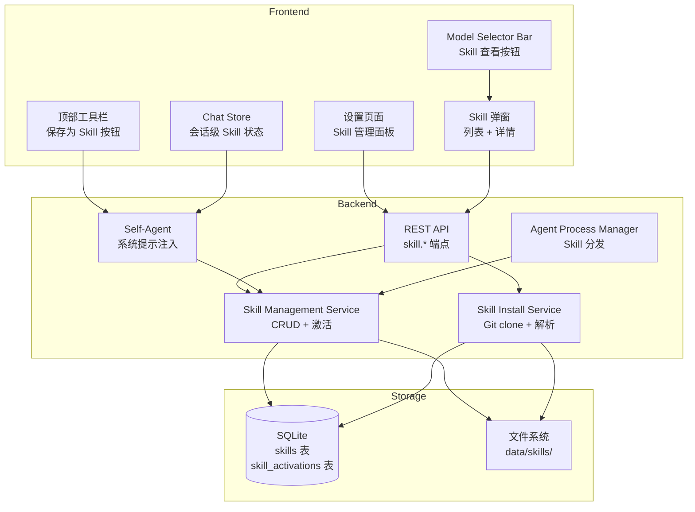
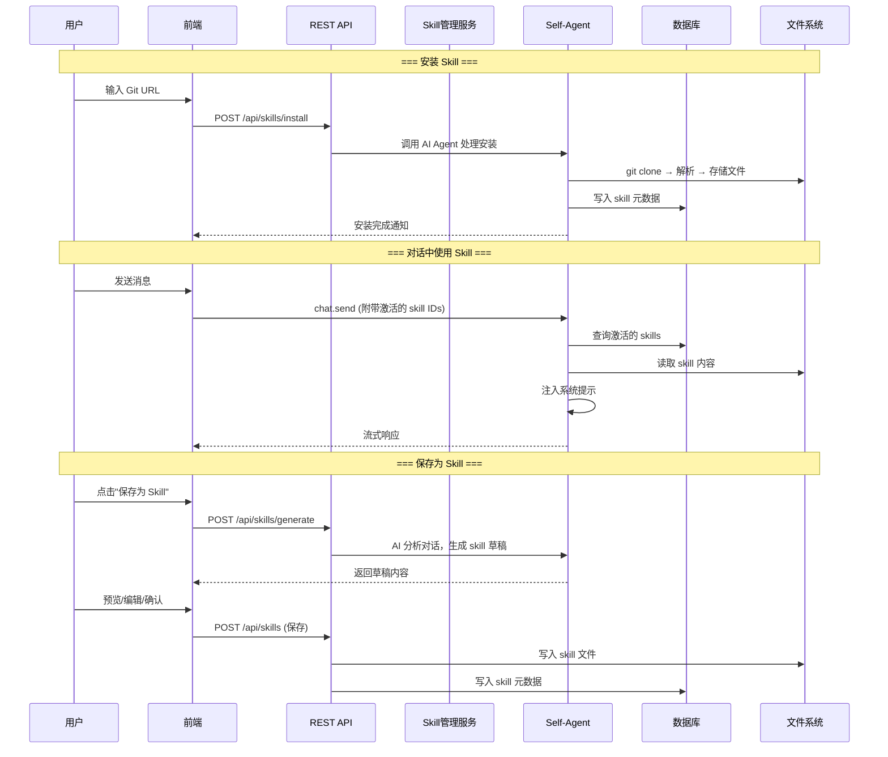

# Skill System - Master Plan

## 1. 项目概述

为 JRAgentMesh 增加 Skill（技能）系统，使用户能够安装、管理和复用 AI 技能。Skill 遵循 Claude Code 的标准格式（markdown 文件），通过 Git 仓库安装，并支持从对话中自动抽象生成新的 skill。

### 核心目标

- **兼容性**：完全兼容 Claude Code / CodeX 的 skill 格式标准
- **易用性**：通过 Git URL 一键安装，UI 管理直观美观
- **智能化**：AI 自动抽象对话内容为可复用 skill
- **可分发**：skill 可传递给 dispatch mode 下的后端 agent

## 2. 范围定义

### 纳入范围

- Skill 文件格式（遵循 Claude Code 标准 markdown）
- 通过 Git 仓库 URL 安装 skill（由 AI Agent 自主处理）
- 项目目录内存储 skill 文件
- 设置页面中的 Skill 管理面板（安装、查看、启用/禁用、删除、更新）
- Model selector 栏的"查看已安装 Skill"按钮 + 弹窗
- 顶部工具栏的"保存为 Skill"按钮
- 保存为 Skill 的完整流程（AI 生成草稿 → 用户预览/编辑 → 确认保存）
- Skill 作用域：全局（设置中）+ 当前会话（对话中）
- Skill 内容注入 self-agent 系统提示
- Skill 分发给后端 agent（追加到指令中，不覆盖 agent 自身 skill）
- 从 Git 仓库一键更新 skill（AI Agent 处理）
- 数据库 schema 支持多用户隔离（当前只有默认用户）

### 不纳入范围

- Skill 市场 / 在线发现
- Skill 之间的依赖管理
- 分类、标签、搜索功能（初期简单列表）
- 多用户权限管理的实际实现（仅预留 schema）

## 3. 高层架构



### 数据流



## 4. 关键设计决策

### 4.1 Skill 文件格式

遵循 Claude Code 标准：纯 markdown 文件，内容为 AI 指令和上下文。文件名即 skill 名。

```
data/skills/
├── installed/           # 从 Git 安装的 skill
│   ├── <skill-name>/    # 每个 Git 仓库一个目录
│   │   ├── .git/        # 保留 Git 信息，用于更新
│   │   ├── skill.md     # 主 skill 文件
│   │   └── ...          # 仓库其他文件
│   └── ...
└── custom/              # 用户从对话中保存的 skill
    ├── <skill-name>.md
    └── ...
```

### 4.2 数据库设计

**skills 表**：

| 字段 | 类型 | 说明 |
|------|------|------|
| id | TEXT PK | UUID |
| name | TEXT | skill 名称 |
| description | TEXT | 描述 |
| source | TEXT | 'git' 或 'conversation' |
| gitUrl | TEXT | Git 仓库 URL（可空） |
| filePath | TEXT | 相对于 data/skills/ 的路径 |
| userId | TEXT | 用户 ID（预留，默认 'default'） |
| isGlobal | INTEGER | 是否全局激活 |
| createdAt | TEXT | 创建时间 |
| updatedAt | TEXT | 更新时间 |

**skill_activations 表**（会话级激活）：

| 字段 | 类型 | 说明 |
|------|------|------|
| id | TEXT PK | UUID |
| skillId | TEXT FK | 关联 skill |
| conversationId | TEXT FK | 关联会话 |
| userId | TEXT | 用户 ID（预留，默认 'default'） |
| createdAt | TEXT | 创建时间 |

### 4.3 Skill 注入机制

- Self-Agent 在构建系统提示时，查询当前激活的 skill（全局 + 当前会话）
- 将 skill 内容追加到系统提示尾部，用分隔标记包裹：

```
<skill name="skill-name">
skill markdown 内容...
</skill>
```

### 4.4 Skill 分发给后端 Agent

- 在 dispatch mode 下，将激活的 skill 内容追加到发送给后端 agent 的指令消息中
- 不修改 agent 工作目录的 `.claude/skills/` 目录，避免副作用
- Skill 内容以文本形式附加在用户指令之前

### 4.5 安装与更新机制

- 安装和更新都通过 Self-Agent 的 AI 能力处理
- 安装：AI Agent 执行 `git clone` 到 `data/skills/installed/`，解析仓库结构，提取 skill 元数据
- 更新：AI Agent 在对应目录执行 `git pull`，更新数据库元数据
- 这些操作通过 self-agent 的 bash 工具完成，用户可以看到执行过程

### 4.6 "保存为 Skill" 流程

1. 用户点击"保存为 Skill"按钮
2. 前端调用 API，传入当前对话 ID
3. 后端调用 self-agent，指令为：分析当前对话内容，提取有价值的最佳实践、方法论和解决方案，抽象为通用 skill
4. AI 生成 skill 草稿（markdown 格式）
5. 前端弹窗展示草稿，用户可编辑 skill 名称和内容
6. 用户确认后，保存到 `data/skills/custom/` 并写入数据库

## 5. 依赖与假设

### 依赖

- 现有 Self-Agent 服务（用于 AI 驱动的安装和内容生成）
- 现有 bash 工具（用于 git 操作）
- SQLite + Drizzle ORM（数据库扩展）
- 现有 WebSocket 协议（实时通知）

### 假设

- 服务器环境有 `git` 命令可用
- Skill 文件大小合理（通常 < 100KB），不会显著增大系统提示
- Claude Code 的 skill 格式在未来保持稳定

## 6. 风险评估

| 风险 | 影响 | 缓解措施 |
|------|------|----------|
| Skill 内容过多导致 token 超限 | 高 | 限制同时激活的 skill 数量，显示 token 估算 |
| 恶意 Git 仓库 | 中 | AI Agent 在 clone 后检查内容合理性 |
| Git 操作失败（网络/认证） | 中 | AI Agent 自主处理错误，反馈用户 |
| Skill 格式不兼容 | 低 | 遵循 Claude Code 标准，做基本格式校验 |
| 多个 Skill 指令冲突 | 中 | 在注入时加清晰分隔，由 AI 自行协调 |

## 7. 规划文档目录

| 序号 | 文件 | 内容 |
|------|------|------|
| 01 | `specs/01-data-model-and-storage.md` | 数据模型、数据库 schema、文件存储结构 |
| 02 | `specs/02-backend-services.md` | Skill 管理服务、安装服务、注入机制、REST API |
| 03 | `specs/03-frontend-skill-management.md` | 设置页面 Skill 管理面板、安装/更新/删除 UI |
| 04 | `specs/04-frontend-chat-integration.md` | 查看 Skill 弹窗、保存为 Skill 流程、会话级激活 |
| 05 | `specs/05-skill-dispatch.md` | Dispatch mode 下的 Skill 分发机制 |
