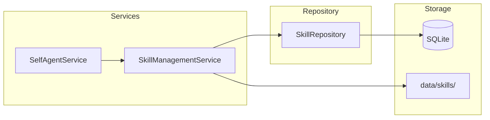
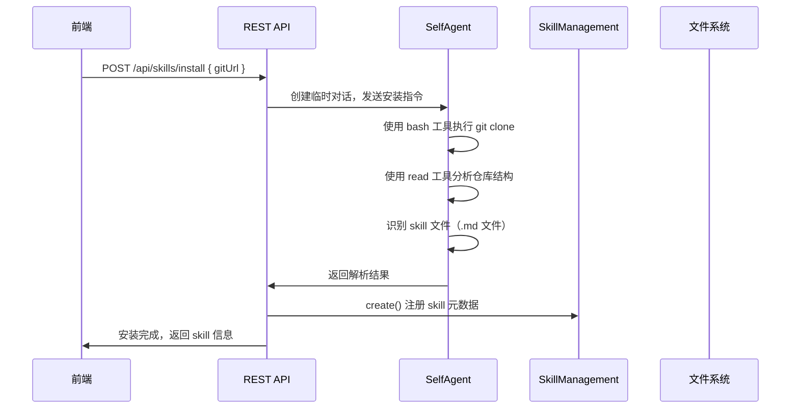

# Spec 02: 后端服务

## 1. 概述

定义 Skill 系统的后端服务层，包括 Skill 管理服务、安装机制、系统提示注入、REST API 端点。

## 2. 服务架构



## 3. SkillManagementService

新建 `server/services/skill-management.ts`。

### 3.1 职责

- Skill 的 CRUD 操作（增删改查）
- 全局激活 / 取消激活
- 会话级激活 / 取消激活
- 获取指定会话的有效 skill 列表及其内容
- Skill 文件的读取与删除

### 3.2 接口定义（伪代码）

```
class SkillManagementService:
    constructor(dataDir: string)

    // --- CRUD ---
    getAll(userId = 'default'): SkillInfo[]
    getById(id: string): SkillInfo | null
    create(params: CreateSkillParams): SkillInfo
    update(id: string, params: UpdateSkillParams): SkillInfo
    delete(id: string): void

    // --- 激活管理 ---
    setGlobalActivation(id: string, active: boolean): void
    activateForConversation(skillId: string, conversationId: string): void
    deactivateForConversation(skillId: string, conversationId: string): void
    getConversationActivations(conversationId: string): SkillInfo[]

    // --- 内容读取 ---
    getActiveSkillContents(userId: string, conversationId: string): SkillContent[]
    getSkillContent(id: string): string | null

    // --- 文件管理 ---
    getSkillsDir(): string
    ensureDirectories(): void
```

### 3.3 数据类型

```
interface SkillInfo:
    id: string
    name: string
    description: string | null
    source: 'git' | 'conversation'
    gitUrl: string | null
    gitDir: string | null
    filePath: string
    conversationId: string | null
    userId: string
    isGlobal: boolean
    createdAt: number
    updatedAt: number

interface CreateSkillParams:
    name: string
    description?: string
    source: 'git' | 'conversation'
    gitUrl?: string
    gitDir?: string
    filePath: string
    conversationId?: string
    userId?: string   // 默认 'default'

interface UpdateSkillParams:
    name?: string
    description?: string

interface SkillContent:
    id: string
    name: string
    content: string     // skill markdown 文件的全部内容
```

### 3.4 关键实现逻辑

**getActiveSkillContents(userId, conversationId)：**

```
1. 从 SkillRepository 获取全局激活的 skill（isGlobal=1, userId匹配）
2. 从 SkillRepository 获取该 conversationId 的会话级激活
3. 合并去重（按 skillId）
4. 逐个读取 filePath 对应的文件内容
5. 过滤掉文件不存在的 skill（记录 warning 日志）
6. 返回 SkillContent 数组
```

**delete(id)：**

```
1. 查询 skill 信息
2. 如果 source='conversation'，删除 data/skills/custom/ 下的文件
3. 如果 source='git'，检查是否有其他 skill 共享同一 gitDir
   - 如果没有，删除整个 data/skills/installed/<gitDir>/ 目录
   - 如果有，只删除数据库记录
4. 从数据库删除 skill 记录（级联删除 activations）
```

## 4. Skill 安装机制

### 4.1 设计思路

Skill 安装不由专门的服务类处理，而是**交给 Self-Agent 自主完成**。用户在前端触发安装后，后端调用 Self-Agent 发送一条特殊指令，让 AI Agent 利用已有的 `bash` 和 `write` 工具完成安装。

### 4.2 安装流程



### 4.3 安装指令模板

当 API 收到安装请求时，构建如下指令发送给 Self-Agent：

```
请执行以下 Skill 安装任务：

1. 将 Git 仓库 clone 到指定目录：
   git clone <gitUrl> <dataDir>/skills/installed/<dirName>

2. 分析仓库结构，找到 skill 文件（.md 文件）

3. 对每个 skill 文件，提取以下信息：
   - 名称（从文件第一个 # 标题提取）
   - 描述（从文件开头的描述段落提取）
   - 文件相对路径

4. 返回 JSON 格式的结果
```

实际实现中，这个流程在一个独立的「安装会话」中进行，不影响用户当前的聊天会话。安装过程通过 WebSocket 实时向前端推送进度。

### 4.4 更新机制

更新同样交给 Self-Agent 处理：

```
请更新以下 Skill：
- 目录：<dataDir>/skills/installed/<gitDir>
- 执行 git pull
- 检查是否有新的 skill 文件或已删除的文件
- 返回更新结果
```

## 5. 系统提示注入

### 5.1 修改 SelfAgentService.buildSystemPrompt()

在现有的 `buildSystemPrompt()` 方法中，追加激活的 skill 内容：

```
function buildSystemPrompt(customPrompt?):
    prompt = customPrompt || DEFAULT_SYSTEM_PROMPT

    if dispatchMode:
        prompt += DISPATCH_PROMPT_SUFFIX

    // 新增：注入 skill 内容
    activeSkills = skillManagementService.getActiveSkillContents(
        'default',
        currentConversationId
    )

    if activeSkills.length > 0:
        prompt += "\n\n# Active Skills\n\n"
        prompt += "The following skills are available. Use them when relevant:\n\n"
        for skill in activeSkills:
            prompt += `<skill name="${skill.name}">\n`
            prompt += skill.content
            prompt += "\n</skill>\n\n"

    return prompt
```

### 5.2 注入时机

系统提示在以下时机重建：

1. **对话切换时** — `loadConversation()` / `createConversation()`
2. **Skill 激活/取消时** — 通过新增的 `refreshSystemPrompt()` 方法
3. **设置变更时** — 现有的 `setSystemPrompt()` 流程

新增 `refreshSystemPrompt()` 方法到 `SelfAgentService`：

```
function refreshSystemPrompt():
    customPrompt = loadSettings().systemPrompt
    prompt = buildSystemPrompt(customPrompt)
    agent.setSystemPrompt(prompt)
```

### 5.3 Token 预算保护

为防止 skill 内容过多导致 token 超限：

- 在注入时计算总字符数（粗略估算 1 token ≈ 4 字符）
- 设置上限（如 50000 字符 ≈ 12500 tokens）
- 超过上限时，按激活顺序截断，并在系统提示中加注释说明部分 skill 被截断

## 6. REST API 端点

所有 skill 相关端点挂载在 `/api/skills` 下。在 `server/express-app.ts` 中添加。

### 6.1 端点列表

| 方法 | 路径 | 说明 |
|------|------|------|
| GET | `/api/skills` | 获取所有 skill |
| GET | `/api/skills/:id` | 获取单个 skill 详情 |
| GET | `/api/skills/:id/content` | 获取 skill 文件内容 |
| POST | `/api/skills` | 创建 skill（从对话保存） |
| PUT | `/api/skills/:id` | 更新 skill 元数据 |
| DELETE | `/api/skills/:id` | 删除 skill |
| POST | `/api/skills/install` | 从 Git 安装 skill |
| POST | `/api/skills/:id/update` | 从 Git 更新 skill |
| PUT | `/api/skills/:id/global` | 设置/取消全局激活 |
| POST | `/api/skills/:id/activate` | 会话级激活 |
| POST | `/api/skills/:id/deactivate` | 会话级取消激活 |
| GET | `/api/skills/active/:conversationId` | 获取某会话的有效 skill |
| POST | `/api/skills/generate` | AI 从对话生成 skill 草稿 |

### 6.2 关键端点详情

**POST /api/skills/install**

```
请求:
{
  "gitUrl": "https://github.com/user/skill-repo.git"
}

响应（成功）:
{
  "success": true,
  "skills": [
    { "id": "...", "name": "Code Review", "description": "...", "filePath": "..." }
  ]
}

响应（失败）:
{
  "error": "git clone failed: ..."
}
```

**POST /api/skills/generate**

```
请求:
{
  "conversationId": "conv-xxx"
}

响应:
{
  "draft": {
    "name": "React Performance Optimization",
    "description": "Best practices for optimizing React application performance",
    "content": "# React Performance Optimization\n\n## Overview\n..."
  }
}
```

这个端点的实现逻辑：

1. 从数据库加载该 conversationId 的所有消息
2. 构建分析指令，发送给 Self-Agent
3. Self-Agent 分析对话内容，生成 skill markdown 草稿
4. 返回草稿内容供前端展示

**POST /api/skills（创建，用于保存编辑后的草稿）**

```
请求:
{
  "name": "React Performance Optimization",
  "description": "Best practices for ...",
  "content": "# React Performance Optimization\n...",
  "conversationId": "conv-xxx"    // 来源会话（可选）
}

响应:
{
  "id": "skill-xxx",
  "name": "React Performance Optimization",
  ...
}
```

实现逻辑：

1. 将 name 转为 kebab-case 作为文件名
2. 写入 `data/skills/custom/<kebab-name>.md`
3. 在数据库创建 skill 记录（source='conversation'）
4. 返回创建的 skill 信息

## 7. 服务注册与初始化

### 7.1 server/index.ts 修改

```
// 启动时初始化
const skillManagement = new SkillManagementService(dataDir);
skillManagement.ensureDirectories();

// 传递给 SelfAgentService
const selfAgent = new SelfAgentService({
    dataDir,
    agentProcessManager,
    fileTransferService,
    skillManagementService: skillManagement,  // 新增
});

// 传递给 Express app
const app = createExpressApp({
    dataDir,
    agentProcessManager,
    selfAgentService: selfAgent,
    skillManagementService: skillManagement,  // 新增
});
```

### 7.2 SelfAgentServiceOptions 扩展

```
interface SelfAgentServiceOptions:
    dataDir: string
    agentProcessManager: AgentProcessManager
    fileTransferService: FileTransferService
    skillManagementService: SkillManagementService  // 新增
```
