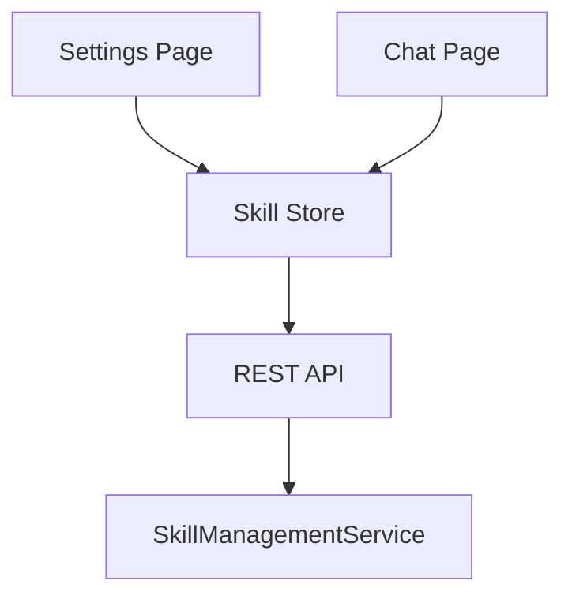

# Spec 03: 前端 Skill 管理

## 1. 概述

定义设置页面中的 Skill 管理面板，包括 skill 列表展示、安装、全局激活/取消、删除、更新、内容查看/编辑。

## 2. 设置页面改造

### 2.1 新增 Tab

在现有 Settings 页面 (`src/app/settings/page.tsx`) 的 Tabs 中新增 "Skills" tab：

```
<TabsList>
    <TabsTrigger value="self-agent">Self Agent</TabsTrigger>
    <TabsTrigger value="skills">Skills</TabsTrigger>          <!-- 新增 -->
    <TabsTrigger value="backend-agents">Backend Agents</TabsTrigger>
    <TabsTrigger value="notifications">Notifications</TabsTrigger>
    <TabsTrigger value="general">General</TabsTrigger>
</TabsList>

<TabsContent value="skills">
    <SkillManagementPanel />
</TabsContent>
```

放在 "Self Agent" 之后，因为 skill 是 self-agent 的能力扩展，逻辑上紧密相关。

## 3. SkillManagementPanel 组件

新建 `src/components/settings/skill-management-panel.tsx`。

### 3.1 布局结构

```
┌─────────────────────────────────────────────────┐
│ Skills                                          │
│                                                 │
│ ┌─────────────────────────────────────────────┐ │
│ │ 📦 Install from Git                         │ │
│ │ ┌─────────────────────────────┐ ┌────────┐  │ │
│ │ │ https://github.com/...      │ │Install │  │ │
│ │ └─────────────────────────────┘ └────────┘  │ │
│ └─────────────────────────────────────────────┘ │
│                                                 │
│ Installed Skills (5)                            │
│ ┌─────────────────────────────────────────────┐ │
│ │ ⚡ Code Review            git   ☑ Global    │ │
│ │   Review code for quality and security      │ │
│ │                     [View] [Update] [Delete] │ │
│ ├─────────────────────────────────────────────┤ │
│ │ ⚡ React Best Practices   conv  ☑ Global    │ │
│ │   Apply React best practices                │ │
│ │                            [View] [Delete]  │ │
│ ├─────────────────────────────────────────────┤ │
│ │ ⚡ API Design Patterns    conv  ☐ Global    │ │
│ │   RESTful API design guidelines             │ │
│ │                            [View] [Delete]  │ │
│ └─────────────────────────────────────────────┘ │
└─────────────────────────────────────────────────┘
```

### 3.2 组件层级

```
SkillManagementPanel
├── SkillInstallSection          # Git URL 安装区域
│   ├── Input (URL)
│   ├── Button (Install)
│   └── SkillInstallProgress     # 安装进度指示
├── SkillList                    # Skill 列表
│   └── SkillCard (×N)           # 单个 Skill 卡片
│       ├── SkillHeader          # 名称 + 来源标签 + 全局开关
│       ├── SkillDescription     # 描述
│       └── SkillActions         # 操作按钮
└── SkillContentDialog           # Skill 内容查看/编辑弹窗
```

### 3.3 SkillInstallSection

**UI 元素：**
- 输入框：placeholder="Enter Git repository URL..."
- 安装按钮：点击后发起安装请求
- 进度指示：安装过程中显示 loading spinner + 文字提示

**交互流程：**

```
1. 用户输入 Git URL
2. 点击 "Install" 按钮
3. 按钮变为 loading 状态，显示 "Installing..."
4. 调用 POST /api/skills/install
5. 成功：显示成功 toast，刷新 skill 列表
6. 失败：显示错误 toast，恢复按钮状态
```

**输入验证：**
- URL 不能为空
- 基本的 URL 格式校验（包含 git 关键词或 .git 后缀，或 github/gitlab 域名）
- 重复 URL 检测（与已安装的 skill 的 gitUrl 比对）

### 3.4 SkillCard

每个 skill 以卡片形式展示：

**信息区域：**
- **名称**：skill.name，粗体
- **来源标签**：`git` 显示为蓝色 badge，`conversation` 显示为绿色 badge
- **描述**：skill.description，灰色小字，最多 2 行截断
- **全局激活开关**：Switch 组件，改变时调用 PUT `/api/skills/:id/global`

**操作按钮（右下角）：**
- **View**：打开 SkillContentDialog 查看/编辑内容
- **Update**：仅 source='git' 时显示，调用 POST `/api/skills/:id/update`
- **Delete**：确认弹窗后调用 DELETE `/api/skills/:id`

### 3.5 SkillContentDialog

弹窗展示 skill 的 markdown 内容，支持编辑。

```
┌──────────────────────────────────────────────┐
│ Code Review                            [✕]   │
│──────────────────────────────────────────────│
│ ┌──────────────────────────────────────────┐ │
│ │ # Code Review                            │ │
│ │                                          │ │
│ │ ## Overview                              │ │
│ │ Use this skill when reviewing code for   │ │
│ │ quality, security, and maintainability.  │ │
│ │                                          │ │
│ │ ## When to Use                           │ │
│ │ - When the user asks to review code      │ │
│ │ ...                                      │ │
│ └──────────────────────────────────────────┘ │
│                                              │
│                       [Cancel]  [Save]       │
│──────────────────────────────────────────────│
│ Name: [Code Review          ]                │
│ Description: [Review code for quality...]    │
└──────────────────────────────────────────────┘
```

**UI 元素：**
- 顶部：skill 名称 + 关闭按钮
- 中间：textarea，显示 skill markdown 内容，可编辑
- 底部：名称输入框 + 描述输入框 + Cancel/Save 按钮

**交互：**
- 加载时调用 GET `/api/skills/:id/content` 获取文件内容
- Save 时：
  1. 如果内容有变，调用 PUT `/api/skills/:id` 更新元数据
  2. 同时发送内容更新（后端写入文件）
- Cancel：关闭弹窗，不保存

## 4. 前端状态管理

### 4.1 Skill Store

新建 `src/stores/skill-store.ts`，使用 Zustand：

```
interface SkillState:
    // 数据
    skills: SkillInfo[]
    isLoading: boolean
    isInstalling: boolean

    // Actions
    fetchSkills(): Promise<void>
    installSkill(gitUrl: string): Promise<void>
    deleteSkill(id: string): Promise<void>
    updateSkillFromGit(id: string): Promise<void>
    setGlobalActivation(id: string, active: boolean): Promise<void>
    getSkillContent(id: string): Promise<string>
    saveSkillContent(id: string, name: string, description: string, content: string): Promise<void>

    // 会话级激活（也在这个 store 管理）
    conversationSkills: Record<string, string[]>   // conversationId → skillId[]
    fetchConversationSkills(conversationId: string): Promise<void>
    activateForConversation(skillId: string, conversationId: string): Promise<void>
    deactivateForConversation(skillId: string, conversationId: string): Promise<void>
```

### 4.2 数据流



设置页面和聊天页面共享同一个 Skill Store，确保状态一致。

## 5. 样式规范

遵循项目现有的设计语言：

- **卡片**：`border border-[var(--border)] rounded-[var(--radius)] p-4`
- **Badge**：小圆角，`text-xs px-2 py-0.5 rounded-full`
  - git 来源：`bg-blue-50 text-blue-600`
  - conversation 来源：`bg-green-50 text-green-600`
- **Switch**：使用现有 `@/components/ui/switch`
- **Button**：使用现有 `@/components/ui/button`，variant="ghost" 用于操作按钮
- **Dialog**：使用现有 `@/components/ui/dialog`（如有）或创建简单 modal
- **间距**：卡片间 `space-y-3`，section 间 `space-y-6`
- **字体**：标题 `text-sm font-semibold`，描述 `text-xs text-[var(--text-secondary)]`
