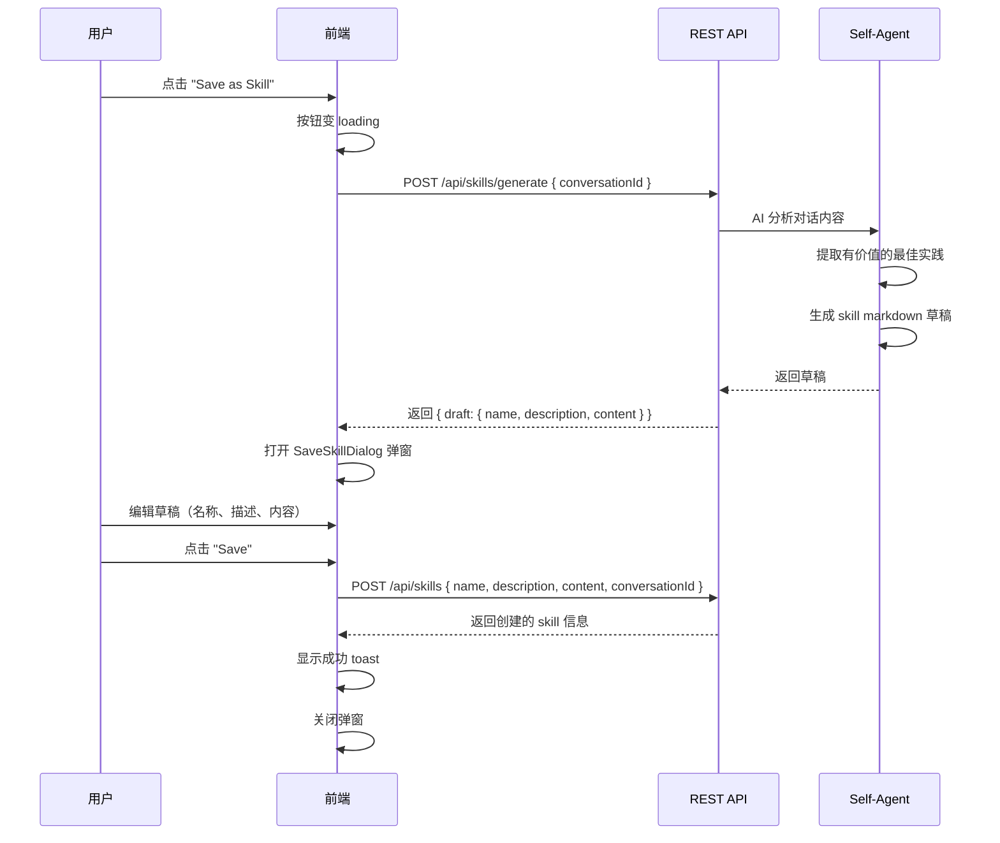

# Spec 04: 前端聊天集成

## 1. 概述

定义聊天界面中与 Skill 系统的交互：Model Selector 栏的 Skill 查看按钮 + 弹窗、顶部工具栏的"保存为 Skill"按钮 + 完整流程、会话级 Skill 激活。

## 2. Model Selector 栏 — Skill 查看按钮

### 2.1 按钮位置

在 `src/components/chat/model-selector.tsx` 中，在 Dispatch Mode 开关**左侧**添加 Skill 按钮：

```
┌──────────────────────────────────────────────────────────────┐
│ [Anthropic ▾] [claude-sonnet-4-5 ▾]    [⚡Skills] Dispatch □ │
└──────────────────────────────────────────────────────────────┘
```

**按钮样式：**
- 使用 `Zap`（闪电）图标 from lucide-react
- 显示 "Skills" 文字
- 如果有 skill 激活，在按钮旁显示数字 badge（如 "Skills (3)"）
- variant="ghost"，与 Dispatch Mode 开关保持视觉一致

### 2.2 点击行为

点击按钮打开 **SkillViewDialog** 弹窗。

## 3. SkillViewDialog — Skill 查看弹窗

### 3.1 弹窗布局

```
┌──────────────────────────────────────────────────────┐
│ Active Skills                                   [✕]  │
│──────────────────────────────────────────────────────│
│                                                      │
│ Global Skills                                        │
│ ┌──────────────────────────────────────────────────┐ │
│ │ ⚡ Code Review                              git  │ │
│ │   Review code for quality and security           │ │
│ ├──────────────────────────────────────────────────┤ │
│ │ ⚡ React Best Practices                    conv  │ │
│ │   Apply React best practices                     │ │
│ └──────────────────────────────────────────────────┘ │
│                                                      │
│ Session Skills                                       │
│ ┌──────────────────────────────────────────────────┐ │
│ │ No session-specific skills activated             │ │
│ │                                                  │ │
│ │          [+ Add skill to this session]           │ │
│ └──────────────────────────────────────────────────┘ │
│                                                      │
│ ┌──────────────────────────────────────────────────┐ │
│ │ Manage all skills →                              │ │
│ └──────────────────────────────────────────────────┘ │
└──────────────────────────────────────────────────────┘
```

### 3.2 功能区域

**Global Skills 区域：**
- 列出所有 isGlobal=true 的 skill
- 只读展示，不可在此处修改全局激活状态
- 点击 skill 名称可展开查看内容摘要（前 3 行）

**Session Skills 区域：**
- 列出当前会话激活的 skill（仅会话级，不重复显示全局的）
- 每个 skill 右侧有"取消"按钮，点击取消会话级激活
- 底部 "Add skill to this session" 按钮

**Add Skill 交互：**

点击 "+ Add skill to this session" 后：
1. 展示所有未激活的 skill 列表（排除已全局激活和已会话激活的）
2. 用户点击某个 skill 即激活
3. 调用 POST `/api/skills/:id/activate` with conversationId
4. 刷新弹窗内容

**底部链接：**
- "Manage all skills →" 跳转到 Settings 页面的 Skills tab

### 3.3 组件层级

```
SkillViewDialog
├── DialogHeader ("Active Skills")
├── GlobalSkillsSection
│   └── SkillListItem (×N)
├── SessionSkillsSection
│   ├── SkillListItem (×N, with remove button)
│   └── AddSkillButton → AddSkillDropdown
└── DialogFooter
    └── Link to Settings/Skills
```

新建 `src/components/chat/skill-view-dialog.tsx`。

## 4. 顶部工具栏 — 保存为 Skill 按钮

### 4.1 按钮位置

在 `src/components/chat/input-area.tsx` 的工具栏中，"Clear" 按钮**左侧**添加：

```
┌──────────────────────────────────────────────────────┐
│ 🧠 [Medium ▾]           [💾 Save as Skill] [🗑 Clear]│
│ ┌──────────────────────────────────────────────────┐ │
│ │ 📎 │ Type a message...                      │ ▶ │ │
│ └──────────────────────────────────────────────────┘ │
└──────────────────────────────────────────────────────┘
```

**按钮样式：**
- 使用 `BookmarkPlus`（书签+）图标 from lucide-react
- 文字 "Save as Skill"
- variant="ghost", size="sm"
- 与 Clear 按钮视觉一致
- 仅当当前对话有消息时才可用（disabled 状态控制）

### 4.2 按钮状态

- **可用条件**：当前对话至少有 1 条用户消息和 1 条 assistant 消息
- **Loading 态**：AI 正在生成 skill 草稿时
- **禁用条件**：无消息 / AI 正在回复 / 正在生成草稿

## 5. 保存为 Skill — 完整交互流程

### 5.1 流程图



### 5.2 SaveSkillDialog — 保存确认弹窗

新建 `src/components/chat/save-skill-dialog.tsx`。

```
┌──────────────────────────────────────────────────────┐
│ Save as Skill                                   [✕]  │
│──────────────────────────────────────────────────────│
│                                                      │
│ Name                                                 │
│ ┌──────────────────────────────────────────────────┐ │
│ │ React Performance Optimization                   │ │
│ └──────────────────────────────────────────────────┘ │
│                                                      │
│ Description                                          │
│ ┌──────────────────────────────────────────────────┐ │
│ │ Best practices for optimizing React app perf...  │ │
│ └──────────────────────────────────────────────────┘ │
│                                                      │
│ Content                                              │
│ ┌──────────────────────────────────────────────────┐ │
│ │ # React Performance Optimization                 │ │
│ │                                                  │ │
│ │ ## Overview                                      │ │
│ │ Apply these best practices when working with     │ │
│ │ React applications to ensure optimal             │ │
│ │ performance.                                     │ │
│ │                                                  │ │
│ │ ## Key Principles                                │ │
│ │ - Use React.memo for expensive components        │ │
│ │ - Prefer useMemo/useCallback for derived data    │ │
│ │ ...                                              │ │
│ └──────────────────────────────────────────────────┘ │
│                                                      │
│ ☑ Activate globally after saving                     │
│                                                      │
│                          [Cancel]  [Save Skill]      │
└──────────────────────────────────────────────────────┘
```

**UI 元素：**
- **Name 输入框**：AI 生成的名称，用户可修改
- **Description 输入框**：AI 生成的描述，用户可修改
- **Content textarea**：AI 生成的 skill markdown 内容，用户可修改
  - 等宽字体（monospace）
  - 足够高度（min-height: 300px），可滚动
- **Global 激活复选框**：默认勾选，保存后立即全局激活
- **Cancel / Save Skill 按钮**

**交互：**
- 弹窗打开时，所有字段填充 AI 生成的草稿
- 用户可自由编辑任何字段
- 点击 Save Skill：
  1. 验证 name 不为空
  2. 调用 POST `/api/skills` 保存
  3. 如果 Global 勾选，额外调用 PUT `/api/skills/:id/global` { active: true }
  4. 成功后关闭弹窗，toast 提示

### 5.3 AI 生成 Skill 的指令

后端在处理 POST `/api/skills/generate` 时，给 Self-Agent 的分析指令：

```
请分析以下对话内容，提取有价值的最佳实践、方法论和解决方案，
将其抽象为一个通用的、可复用的 Skill。

要求：
1. 识别对话中核心的知识点和解决方案
2. 去掉特定于当前场景的细节，提炼为通用规则
3. 生成符合 Claude Code Skill 格式的 markdown 文件
4. 包含以下部分：
   - 标题和概述
   - 使用场景（When to Use）
   - 核心指南/规则
   - 注意事项

请以 JSON 格式返回：
{
  "name": "Skill 名称",
  "description": "一句话描述",
  "content": "完整的 markdown 内容"
}

对话内容：
---
[此处附加对话的消息摘要]
---
```

## 6. 会话级 Skill 激活的状态同步

### 6.1 WebSocket 消息

当会话级 skill 激活/取消时，需要通知后端刷新系统提示。

新增消息类型（添加到 `shared/types.ts`）：

```
// Client → Server
'chat.set_session_skills'

interface ChatSetSessionSkillsPayload:
    conversationId: string
    skillIds: string[]    // 当前会话激活的 skill ID 列表
```

后端收到此消息后，调用 `selfAgentService.refreshSystemPrompt()` 更新系统提示。

### 6.2 前端状态

在 Skill Store 中维护 `conversationSkills` 状态：

```
conversationSkills: {
    "conv-xxx": ["skill-1", "skill-2"],
    "conv-yyy": ["skill-3"],
}
```

切换对话时，从 API 加载该对话的会话级 skill。

## 7. 组件文件清单

| 文件 | 说明 |
|------|------|
| `src/components/chat/skill-view-dialog.tsx` | Skill 查看弹窗（Model Selector 栏） |
| `src/components/chat/save-skill-dialog.tsx` | 保存为 Skill 弹窗（含编辑功能） |
| `src/stores/skill-store.ts` | Skill 前端状态管理 |

Model Selector 和 Input Area 是修改现有文件，不新建。
